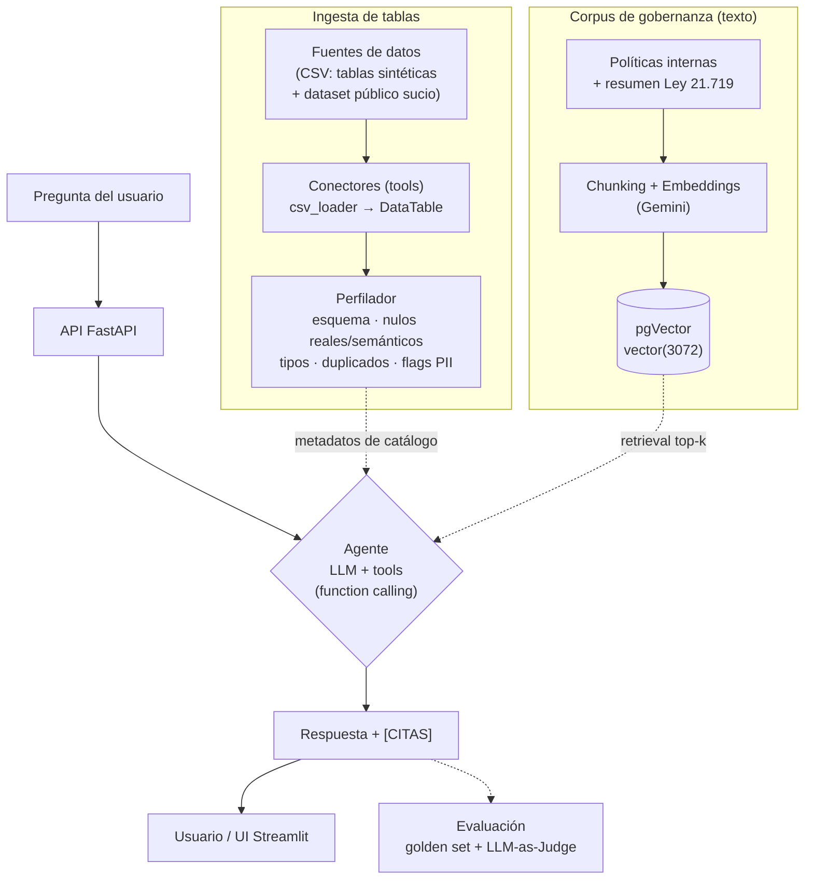

# Agente de Gobernanza de Datos (RAG + Conectores)

Agente de IA al que le **conectas tablas vengan de donde vengan**; las **perfila** automáticamente
(esquema, calidad, posibles datos personales/PII), las **cataloga**, y responde preguntas de gobernanza
en lenguaje natural **citando la fuente exacta** (la política, la ley o la columna).

> **En una frase:** le conecto una tabla que nunca vio y me dice qué es, qué riesgos de calidad y de
> datos personales tiene, y qué dice la política o la ley al respecto — **citando todo**.

**Conceptos y tecnologías:** AI agents · function calling / tools · RAG con citas · embeddings ·
vector database (pgVector **y** BigQuery vector search) · data profiling · PII detection · FastAPI · Docker ·
**Google Cloud Run · Secret Manager** · LLM-as-Judge (evaluación).

## Demo en vivo

| | URL |
|---|---|
| **UI (Streamlit)** — pruébalo aquí | https://gobernanza-ui-894574251129.us-central1.run.app |
| API (documentación interactiva) | https://asistente-rag-gobernanza-894574251129.us-central1.run.app/docs |

Desplegado en **Google Cloud Run** (dos servicios: API + UI), con el corpus de gobernanza en
**BigQuery** como vector store (autenticación por IAM, sin contraseñas) y la API key gestionada con
**Secret Manager**. La arquitectura de recuperación es **enchufable** (`RAG_BACKEND`): `pgVector` para
correr local con Docker, `bigquery` para la nube.

> ⚠️ Es una demo personal con **cuota gratuita** de Gemini. Para protegerla del abuso, `/ask` tiene
> **rate limit por IP** (6/min) y un **tope global diario** (100 preguntas/día); si lo alcanzas, vuelve
> a intentar más tarde. La primera petición puede tardar unos segundos (*cold start* de Cloud Run).

## ¿Por qué este proyecto?
En bancos y retail, los analistas pierden horas entendiendo de dónde viene un dato, si es confiable y si
pueden usarlo sin violar normativa. Este agente ingiere la tabla, la perfila y responde con citas, reduciendo
tiempo y riesgo de incumplimiento. No es un chatbot de juguete: tiene dominio (gobernanza de datos),
conectividad real, trazabilidad (citas) y evaluación medible.

Todos los datos del repo son **sintéticos o públicos** (tablas generadas, políticas de ejemplo y un resumen
de la Ley 21.719 de Protección de Datos de Chile). No contiene información real ni sensible.

## Arquitectura



El agente **decide qué herramienta usar** según la pregunta (esto es lo que lo hace un *agente* y no un
chatbot): perfilar una tabla, listar el catálogo, o consultar el corpus de gobernanza (RAG con citas).
El loop de razonamiento (estilo ReAct) está construido **desde cero**, sin frameworks de agentes, para
mostrar la mecánica de function calling y poder depurarla.

## Stack
- **Python 3.12** + **FastAPI** (API REST) + **Streamlit** (UI de demo)
- **PostgreSQL + pgVector** (base vectorial) — corre en **Docker**
- **Gemini** como LLM/embeddings (proveedor **intercambiable** vía variable de entorno)
- **pandas** para el perfilado de datos
- Agente con **function calling** (tools) y loop de razonamiento propio (sin frameworks de agentes)
- **LLM-as-Judge** + golden set para evaluación objetiva

## Componentes
- `app/connectors/` — ingesta multi-fuente con una interfaz común (`DataTable`): CSV (autodetección de encoding/separador), **Postgres** y **BigQuery** (opcional). Agregar una fuente nueva no cambia el resto del sistema.
- `app/profiler/` — perfilado de calidad: nulos reales y semánticos, tipos inferidos, duplicados y detección heurística de PII.
- `app/rag/` — chunking, embeddings (Gemini), indexación en pgVector y recuperación con similitud coseno.
- `app/agent/` — herramientas (tools), catálogo en memoria y loop de function calling con reintentos ante rate limits.
- `app/api/` — API FastAPI que expone el agente como servicio HTTP.
- `app/ui/` — UI Streamlit (cliente HTTP de la API): perfila una tabla y conversa con el agente.
- `app/evaluation/` — LLM-as-Judge: evalúa al agente contra un golden set y reporta métricas.

## Cómo correr (1 comando)

Requisitos: **Docker Desktop** abierto y un archivo `.env` (copia `.env.example` y completa tu
`GOOGLE_API_KEY`; se recomienda `LLM_MODEL=gemini-2.5-flash`).

```bash
docker compose up -d --build
```

Esto levanta tres servicios: la base vectorial (`db`), la API (`api`, puerto 8000) y la UI (`ui`, puerto 8501).

La **primera vez** (base de datos vacía), indexa el corpus de gobernanza una sola vez:

```bash
docker compose run --rm api python scripts/indexar_corpus.py
```

Luego abre:
- **API (Swagger):** http://localhost:8000/docs
- **UI (demo):** http://localhost:8501

Para apagar todo: `docker compose down`.

<details>
<summary>Alternativa sin Docker para la app (solo la DB en Docker)</summary>

```bash
docker compose up -d db                 # solo la base vectorial
python -m venv .venv
.venv\Scripts\activate                  # Windows (Linux/Mac: source .venv/bin/activate)
pip install -r requirements.txt
python scripts/check_setup.py           # verifica DB + Gemini
python scripts/indexar_corpus.py        # indexa el corpus (una vez)
uvicorn app.api.main:app --reload       # API en http://localhost:8000/docs
streamlit run app/ui/app.py             # UI en http://localhost:8501
```
</details>

## Evaluación (golden set + LLM-as-Judge)

La calidad no se afirma, se mide. Un **golden set** de 24 casos (pregunta + respuesta esperada + fuente
esperada) sirve de pauta; un **LLM-as-Judge** compara la respuesta del agente contra esa pauta y emite un
veredicto estructurado. La verificación de qué *tool* usó el agente es **determinista** (se lee de la traza),
no la juzga el LLM.

```bash
python scripts/evaluar.py            # set completo → reportes/evaluacion_agente.md
python scripts/evaluar.py --limit 3  # subconjunto rápido (cuida la cuota del free tier)
```

**Métricas** (se completan tras la corrida limpia del set completo):

| Métrica | Valor |
|---|---|
| Respuesta correcta | _pendiente corrida completa_ |
| Cita correcta | _pendiente corrida completa_ |
| Tool correcta (determinista) | _pendiente corrida completa_ |
| Score promedio (1–5) | _pendiente corrida completa_ |

> En una corrida parcial (4/24 casos, free tier) el agente obtuvo 100% en respuesta, cita y tool, con
> score 5.00/5. El número definitivo se reportará sobre los 24 casos.

## Tests
- `python scripts/test_conector.py` — conector CSV
- `python scripts/test_perfilador.py` — perfilador
- `python scripts/test_rag.py` — recuperación del RAG
- `python scripts/test_agente.py` — agente de extremo a extremo (function calling)
- `python scripts/test_api.py` — API (requiere el servidor levantado)

## Estado
**MVP completo, dockerizado y desplegado en la nube.** Implementado: conectores multi-fuente
(CSV/Postgres/BigQuery) con interfaz común, perfilador con detección de PII, RAG con citas y **backend de
vector store enchufable** (pgVector local / BigQuery en la nube), agente con function calling, API REST,
UI Streamlit, evaluación con golden set + LLM-as-Judge, empaquetado multi-servicio en Docker, y **deploy en
Google Cloud Run** (API + UI) con BigQuery como vector store (auth por IAM) y la API key en Secret Manager.
